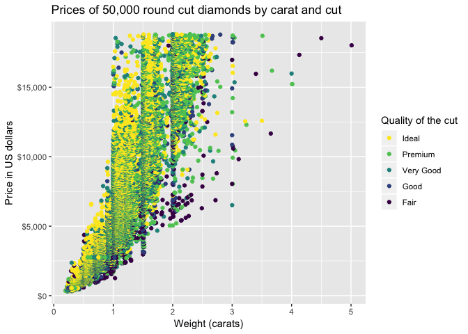
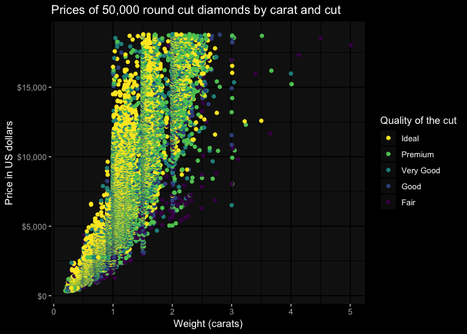
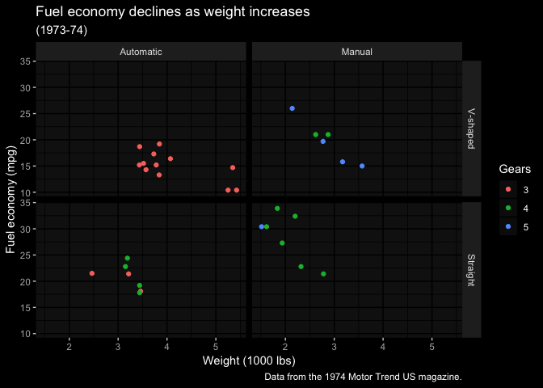
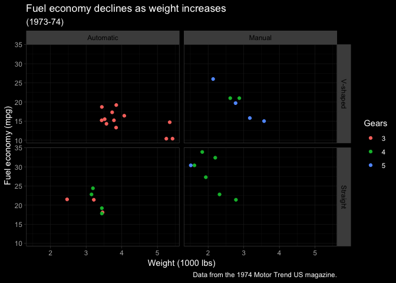
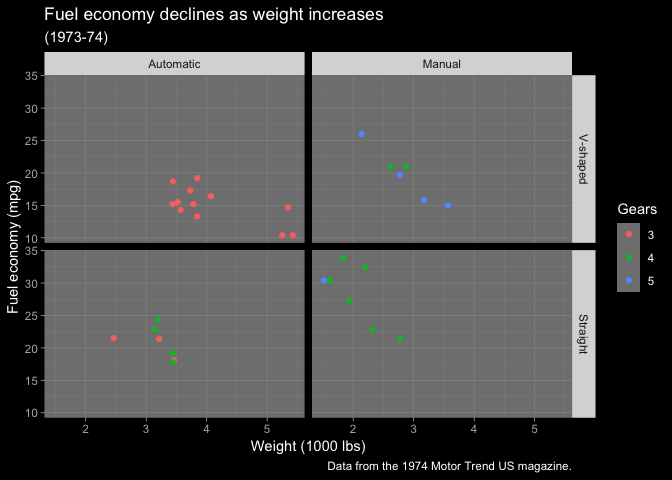
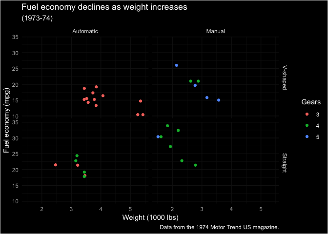
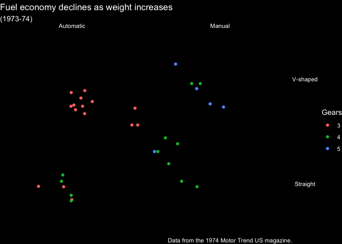
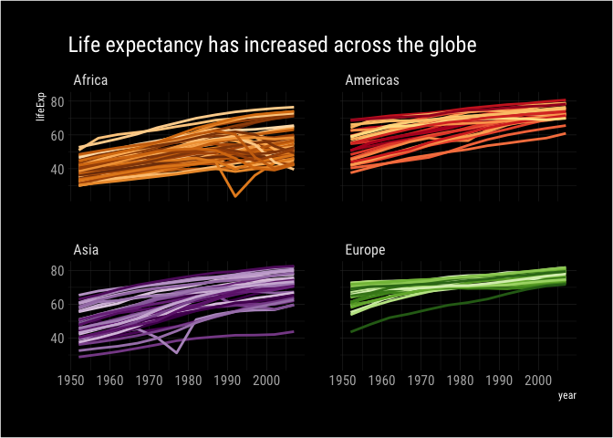

<!-- README.md is generated from README.Rmd. Please edit that file -->
ggdark
======

[](https://travis-ci.org/nsgrantham/ggdark) [](https://ci.appveyor.com/project/nsgrantham/ggdark)

Installation
------------

You can install ggdark from github with:

``` r
# install.packages("devtools")
devtools::install_github("nsgrantham/ggdark")
```

Dark mode for ggplot2
---------------------

``` r
library(ggplot2)

p <- ggplot(diamonds, aes(carat, price)) + 
  geom_point(aes(color = cut)) + 
  scale_y_continuous(label = scales::dollar) +
  guides(color = guide_legend(reverse = TRUE)) +
  labs(title = "Prices of 50,000 round cut diamonds by carat and cut",
       x = "Weight (carats)",
       y = "Price in US dollars",
       color = "Quality of the cut")

p + theme_gray()  # ggplot default
```



``` r
library(ggdark)

p + dark_theme_gray()  # the dark version
#> Geom defaults updated to fill = 'white', color = 'white'.
#> To restore the original values, use update_geom_colors().
```



``` r
# modify the theme to your liking, as you would in ggplot2
p + dark_theme_gray(base_family = "Fira Sans Condensed Light", base_size = 14) + 
  theme(plot.title = element_text(family = "Fira Sans Condensed"),
        plot.background = element_rect(fill = "grey10"),
        panel.background = element_blank(),
        panel.grid.major = element_line(color = "grey30", size = 0.2),
        panel.grid.minor = element_line(color = "grey30", size = 0.2),
        legend.background = element_blank(),
        axis.ticks = element_blank(),
        legend.key = element_blank(),
        legend.position = c(0.815, 0.27))
```


Dark themes
-----------

ggdark provides dark versions of all themes available in ggplot2:

``` r
mtcars2 <- within(mtcars, {
  vs <- factor(vs, labels = c("V-shaped", "Straight"))
  am <- factor(am, labels = c("Automatic", "Manual"))
  cyl  <- factor(cyl)
  gear <- factor(gear)
})

p <- ggplot(mtcars2) +
  geom_point(aes(x = wt, y = mpg, colour = gear)) +
  facet_grid(vs ~ am) +
  labs(title = "Fuel economy declines as weight increases",
       subtitle = "(1973-74)",
       caption = "Data from the 1974 Motor Trend US magazine.",
       x = "Weight (1000 lbs)",
       y = "Fuel economy (mpg)",
       colour = "Gears")
```

``` r
p + dark_theme_gray()
```



``` r
p + dark_theme_bw()
```


``` r
p + dark_theme_linedraw()
```


``` r
p + dark_theme_light()  # quite dark
```



``` r
p + dark_theme_dark()  # quite light
```



``` r
p + dark_theme_minimal()
```



``` r
p + dark_theme_classic()
```


``` r
p + dark_theme_void()
```



Make your own dark theme
------------------------

Use`dark_mode` on any theme to create its dark version.

``` r
update_geom_colors()
#> Geom defaults updated to fill = 'black', color = 'black'.

p <- ggplot(iris, aes(Sepal.Width, Sepal.Length)) +
  geom_point() +
  facet_wrap(~ Species) +
  labs(title = "Iris virginica shows the greatest variation in sepal size",
       y = "Length of sepal (cm)",
       x = "Width of sepal (cm)")
```

``` r
# install.packages("ggthemes")
library(ggthemes)

p + theme_fivethirtyeight()
```


``` r
p + dark_mode(theme_fivethirtyeight(), geom_color = "purple")  # custom geom color
#> Geom defaults updated to fill = 'white', color = 'purple'.
#> To restore the original values, use update_geom_colors().
```


``` r
update_geom_colors()
#> Geom defaults updated to fill = 'black', color = 'black'.
```

``` r
# install.packages("hrbrthemes")
library(hrbrthemes)
#> NOTE: Either Arial Narrow or Roboto Condensed fonts are *required* to use these themes.
#>       Please use hrbrthemes::import_roboto_condensed() to install Roboto Condensed and
#>       if Arial Narrow is not on your system, please see http://bit.ly/arialnarrow

p + theme_ipsum_rc()
```


``` r
p + dark_mode(theme_ipsum_rc(), verbose = FALSE)  # do not print update messages
```



``` r
update_geom_colors(verbose = FALSE)  # do not print update messages
```

------------------------------------------------------------------------

Happy plotting! 🖤
